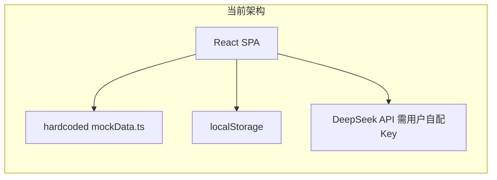
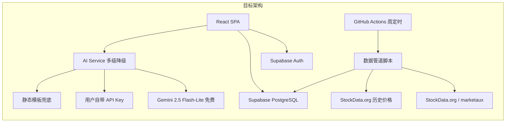

# TradeSense 生产级升级计划

## 当前架构 vs 目标架构







## 免费额度评估

- **Supabase Free**: 500MB DB, 50k MAU, 无限 API 请求, 2 个项目
  - 注意: 1 周无活动会暂停，需 keep-alive cron
- **Gemini 2.5 Flash-Lite Free**: 15 RPM, 1000 请求/天
  - 足够支撑每天数百用户的 AI 解释需求
- **StockData.org Free**: 100 请求/天
  - 周更频率下绰绰有余（每周约 10-20 请求）
- **GitHub Actions Free**: 2000 分钟/月
  - 每周跑一次数据管道，每次 ~2 分钟，完全够用
- **Vercel Free**: 自动部署，100GB 带宽/月

## Phase 1: Supabase 集成 + 用户系统

### 1.1 Supabase 初始化

- 创建 Supabase 项目
- 安装 `@supabase/supabase-js`
- 创建 `web/src/lib/supabase.ts` 客户端初始化
- 环境变量: `VITE_SUPABASE_URL`, `VITE_SUPABASE_ANON_KEY`

### 1.2 数据库 Schema

将当前 [mockData.ts](web/src/models/mockData.ts) 的硬编码数据迁移到 PostgreSQL:

```sql
-- 股票事件组 (对应当前 EventGroup)
create table event_groups (
  id uuid primary key default gen_random_uuid(),
  stock_symbol text not null,
  stock_name text not null,
  category text not null default '其他',
  source text default 'manual',  -- manual | auto | seed
  created_at timestamptz default now()
);

-- 单个事件 (对应当前 HistoricalEvent)
create table events (
  id uuid primary key default gen_random_uuid(),
  event_group_id uuid references event_groups on delete cascade,
  description text not null,
  event_date date not null,
  stock_symbol text not null,
  stock_name text not null,
  actual_performance numeric not null,
  days_after_event int not null default 1,
  source_url text,
  created_at timestamptz default now()
);

-- 用户扩展信息 (Supabase Auth 管理基础账号)
create table profiles (
  id uuid primary key references auth.users on delete cascade,
  display_name text,
  ai_provider text default 'gemini',
  created_at timestamptz default now()
);

-- 用户统计
create table user_stats (
  user_id uuid primary key references auth.users on delete cascade,
  total_attempts int default 0,
  correct_predictions int default 0,
  current_streak int default 0,
  max_streak int default 0,
  updated_at timestamptz default now()
);

-- 用户成就
create table user_achievements (
  user_id uuid references auth.users on delete cascade,
  achievement_id text not null,
  unlocked_at timestamptz default now(),
  primary key (user_id, achievement_id)
);

-- 用户错题
create table user_wrong_answers (
  id uuid primary key default gen_random_uuid(),
  user_id uuid references auth.users on delete cascade,
  event_group_id uuid references event_groups,
  user_prediction text not null,
  correct_answer text not null,
  created_at timestamptz default now()
);
```

Row Level Security (RLS) 策略: 用户只能读写自己的 stats/achievements/wrong_answers, event_groups 和 events 所有人可读。

### 1.3 数据迁移

- 写一个 seed 脚本将 `mockData.ts` 的 60+ 股票数据导入 Supabase
- 新建 `web/src/services/eventService.ts` 替代直接引用 mockData:
  - `fetchRandomEventGroup(category?, search?)` - 从 Supabase 随机取
  - `fetchDailyChallenge(date, count)` - 基于日期的确定性查询
  - 离线降级: 本地缓存最近 50 个 event_groups 到 localStorage

### 1.4 用户认证

- 新建 `web/src/components/AuthModal.tsx` - 登录/注册弹窗
- 支持: Email + 密码, Google OAuth
- 当前 [App.tsx](web/src/App.tsx) 改造:
  - 未登录: 可以玩 (匿名模式, 数据存 localStorage, 和现在一样)
  - 已登录: 数据同步到 Supabase, 跨设备
- 新建 `web/src/hooks/useAuth.ts`
- 新建 `web/src/services/userService.ts` - 管理 stats/achievements/wrong_answers 的云端同步

### 1.5 改造现有 hooks

- [useTradingSession.ts](web/src/hooks/useTradingSession.ts): 从 Supabase 获取事件, 登录时保存 stats 到云端
- [useWrongAnswers.ts](web/src/hooks/useWrongAnswers.ts): 登录时同步到 `user_wrong_answers` 表
- [useAchievements.ts](web/src/hooks/useAchievements.ts): 登录时同步到 `user_achievements` 表
- 所有 hook 保持 localStorage 作为离线缓存/匿名模式

## Phase 2: 动态数据管道

### 2.1 数据管道脚本

新建 `pipeline/` 目录 (项目根目录下):

```
pipeline/
  fetch-news.ts      -- 从 StockData.org 获取最近一周的金融新闻
  fetch-prices.ts    -- 获取对应股票的价格变动
  generate-events.ts -- 将新闻+价格组合为 event_groups
  seed.ts            -- 将 mockData 导入 Supabase
  package.json       -- 独立依赖
```

- 数据流:
  1. 从 StockData.org News API 获取过去一周的重大金融新闻
  2. 用股票代码匹配，获取事件前后的价格变动
  3. 生成 event_group + events 记录
  4. 插入 Supabase (source = 'auto')

### 2.2 GitHub Actions 定时任务

新建 `.github/workflows/data-pipeline.yml`:

- Schedule: 每周日 UTC 00:00
- 步骤: checkout -> install -> 运行 pipeline 脚本 -> 将新数据写入 Supabase
- Secrets: `SUPABASE_URL`, `SUPABASE_SERVICE_ROLE_KEY`, `STOCKDATA_API_KEY`

### 2.3 Keep-alive Cron

在同一个 workflow 中加一个 daily cron, 对 Supabase 做一次简单查询防止项目被暂停。

## Phase 3: AI 多级降级策略

### 3.1 AI Service 重构

替换当前的 [deepSeekService.ts](web/src/services/deepSeekService.ts) 为新的 `web/src/services/aiService.ts`:

```
降级链:
1. Gemini 2.5 Flash-Lite (免费, 1000 RPD) -- 默认
2. 用户自带 Key (存 localStorage, 支持 DeepSeek/OpenAI/Gemini)
3. 静态模板兜底 (基于 actualPerformance 的预写模板, 无需 API)
```

逻辑:

- 先尝试 Gemini free tier
- 如果 429 (rate limit) 或失败, 检查用户是否配置了自己的 key
- 如果都没有, 使用静态模板: "该股票在事件后{X}天{涨/跌}{Y}%，主要受{事件描述}影响。"

### 3.2 API Key 管理 UI

- 在设置/个人中心页面增加 "AI 设置" 区域
- 用户可选择: 免费 AI (Gemini) / 自带 Key
- 自带 Key 只存 localStorage, 永远不上传到服务器

### 3.3 Gemini 集成

- Gemini REST API 非常简单, 直接从前端 fetch (CORS 友好)
- 使用 `gemini-2.5-flash-lite` 模型
- API Key 通过 Vercel 环境变量注入: `VITE_GEMINI_API_KEY`

## Phase 4: 生产打磨

- RLS 策略确保数据安全
- 错误边界组件 (`ErrorBoundary`)
- 离线模式优化 (PWA service worker 缓存最近的事件数据)
- 登录/未登录状态的平滑过渡
- SEO meta tags + Open Graph
- Vercel Analytics (免费)

## 风险和注意事项

- **Supabase 暂停**: 免费项目 1 周无活动会暂停。解决: GitHub Actions daily keep-alive。
- **Gemini 限额收紧**: 2025-12 已大幅缩减过一次。解决: 三级降级策略保底。
- **StockData.org 限额**: 100 请求/天。解决: 周更模式, 每周只用 10-20 请求。
- **数据质量**: 自动抓取的新闻可能不适合做题。解决: 可以后续加管理后台人工审核, 初期先自动上线。

